# APP WEB PARA EL MANEJO DE INCIDENCIAS INFORMÁTICAS EN LA UNIVERSIDAD CÉSAR VALLEJO LIMA NORTE 

---
## 📜 Descripción general del proyecto

Este proyecto tiene como propósito el desarrollo de una plataforma web que permita gestionar y realizar un seguimiento de las incidencias informáticas dentro de una organización. A través de esta aplicación, los usuarios podrán registrar y reportar los problemas técnicos que surjan en los sistemas, equipos o servicios informáticos, mientras que los técnicos podrán darles seguimiento hasta su resolución.

La aplicación ofrecerá una interfaz amigable de utilizar para crear reportes de incidencias, asignar tareas a los responsables de su atención, seguir el avance de la solución y, al final, generar informes detallados sobre el proceso de resolución, las acciones realizadas y los tiempos de intervención.

El sistema tiene como objetivo mejorar la eficacia en la gestión de incidencias, centralizar la información y generar reportes que permitan analizar patrones, tiempos de respuesta y las áreas de oportunidad en el servicio de soporte técnico. También se busca optimizar la comunicación entre los usuarios que reportan los problemas y los técnicos encargados de su resolución, lo que resultará en una atención más ágil y en una administración más eficiente de los recursos tecnológicos de la organización. 📈

## :mag_right: Tecnologías Usadas

- *Workflow*
    - GitHub
- *Backend*:
    - Spring Boot
    - Maven
        - *Dependencias*: 
            - Spring Security
            - Spring Web
            - MySQL Driver
            - Lombok
            - All JWT
- *Frontend*:
    - React
    - Bootstrap
        - *Dependencias*:
            - axios
            - react-dom
            - react-scripts
            - web-vitals
- *Base de datos*:
    - MySQL

---
## 🔹 1. Instalación para el proyecto

> [!NOTE] 
> ## :inbox_tray: Instalación
>Para ejecutar el proyecto localmente, sigue los siguientes pasos:
>1. Clona este repositorio:
>     ~~~bash
>     git clone https://github.com/MathiasUX/HERRAMIENTAS-DE-DESARROLLO.git
>     ~~~
>2. Abre el proyecto en tu entorno de desarrollo.
> 
>      
> 
> 
>   3. Compila y ejecuta los proyectos.
>   
>       **Backend**:
>       ~~~bash
>       cd Proyect_Integrator_1\ucvBackend
>       mvn clean install
>       mvn spring-boot:run         
>       ~~~
>
>       **Frontend**:
>       ~~~bash
>       cd Proyect_Integrator_1\ucvfrontend
>       npm install
>       npm start         
>       ~~~
>
>       **Base de datos**:
>
>       Ejecutar el [script](https://github.com/Renzito0637d/Proyect_Integrator_1/blob/main/script_db.sql "Script de la base de datos")  en MySQL Workbench, **en caso de no haber conexión  con la base de datos configurar [app properties](https://github.com/Renzito0637d/Proyect_Integrator_1/blob/main/ucvBackend/src/main/resources/application.properties "En este archivo del proyecto podrás configurar la conexión de la base de datos MySQL") debes de configurar la _url_, _username_ y _password_ de la DB**.
>       ~~~bash
>       create DATABASE ucvincidencia;
>       use ucvincidencia;         
>       ~~~
---

## :clipboard: Roles y Funciones del equipo
| ID  | Nombre del Rol 👨‍💻     | Encargado 💡      | Función  📏                                                                 |
|-----|----------------------|--------------------|-------------------------------------------------------------------------|
| R1  | Programador Backend   | [Fernández Valenzuela, Jeffri Mathias]         | Encargado de la lógica de negocio, bases de datos y APIs.               |
| R2  | Programador Frontend  | [Morales Dominguez, Jans Snider]         | Encargado del diseño y desarrollo de la interfaz de usuario (UI).      |
| R3  | Programador Full-Stack| [Rodriguez Santa Cruz, André Martín]         | Encargado de integrar el frontend con el backend y trabajar en ambos.  |
| R4  | Tester / QA           | [Virhuez Zavaleta, Giovanni Elber]         | Encargado de realizar pruebas, depuración y asegurar la calidad del código.|
| R5  | Merge finales        |  [Rodriguez Santa Cruz, André Martín]         | Fusionar todas las ramas y merge final.|

---

## :clipboard: Requerimientos Funcionales (RF)
| ID  | Descripción                                                                                              | Encargado             |
|-----|----------------------------------------------------------------------------------------------------------|-------------------|
| RF1 | El aplicativo permite el acceso a los recursos mediante un login                                         | Jeffri Mathias   |
| RF2 | El aplicativo debe permitir la navegabilidad de los formularios mediante un menú                         | Jeffri Mathias   |
| RF3 | El aplicativo permite el registro de tipos de incidencias informáticas y realizar el mantenimiento correspondiente | Jeffri Mathias |
| RF4 | El aplicativo permite el registro de los empleados de la empresa y realizar el mantenimiento correspondiente | Jans Snider |
| RF5 | El aplicativo permite el registro de áreas y realizar el mantenimiento correspondiente                   | Jans Snider |
| RF6 | El aplicativo permite el registro de una incidencia informática y realizar el mantenimiento correspondiente | Jans Snider     |
| RF7 | El aplicativo permite asignar a un personal para la solución de la incidencia informática                 | André Martín   |
| RF8 | El aplicativo permite al empleado registrar los detalles de la solución y observaciones de la incidencia solucionada | André Martín|
| RF9 | El aplicativo permite realizar el seguimiento de la incidencia visualizando su estado: En proceso, Atendido, Derivado | Giovanni Elber       |
| RF10| El aplicativo permite visualizar la lista de incidencias por rango de fechas                             | Giovanni Elber|

---
## 🚀 Flujo de trabajo en Git

Este documento explica los pasos básicos para trabajar con **Git** y **GitHub** de forma ordenada.
---
---

> [!NOTE]  
> ## 🔹 2. Inicialización del repositorio  
> Para iniciar y configurar tu repositorio en Git y conectarlo con GitHub, sigue estos pasos:  
> 
> 1. Inicializa el repositorio y configura tus credenciales:  
>    ~~~bash
>    git init
>    git config --global user.name "MoralesDominguezJansSnider"
>    git config --global user.email "u22330117@utp.edu.pe"
>    ~~~  
> 
> 2. Crea archivos básicos para el proyecto:  
>    ~~~bash
>    touch README.md
>    touch .gitignore
>    touch LICENSE
>    ~~~  
> 
> 3. Revisa el estado y añade los cambios:  
>    ~~~bash
>    git status
>    git add .
>    ~~~  
> 
> 4. Realiza el primer commit:  
>    ~~~bash
>    git commit -m "primer commit de configuración"
>    ~~~  
> 
> 5. Conecta con el repositorio remoto y sube los cambios:  
>    ~~~bash
>    git remote add origin https://github.com/MathiasUX/HERRAMIENTAS-DE-DESARROLLO.git
>    git push -u origin master
>    ~~~  
---
## 🔹 3. IMAGEN DE REPOSITORIO

---
## 🔹 4. PRIMER MERGE
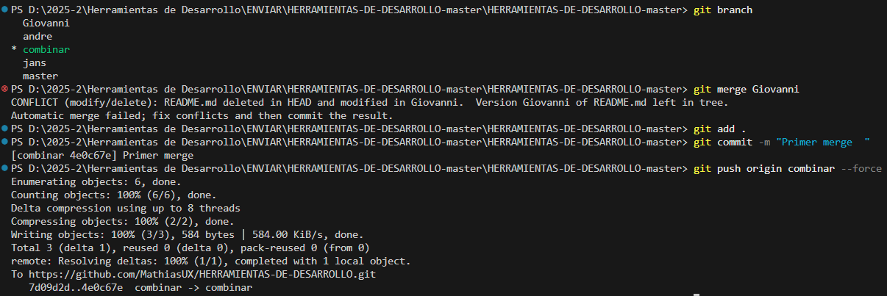
---
## 🔹 5. SEGUNDO MERGE 
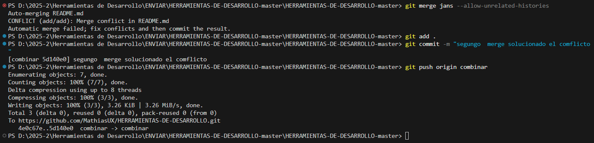
---
## 🔹 6. CONFLICTO DE MERGE
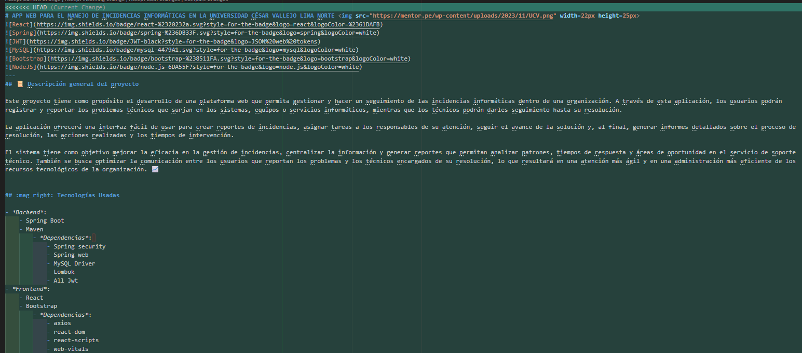
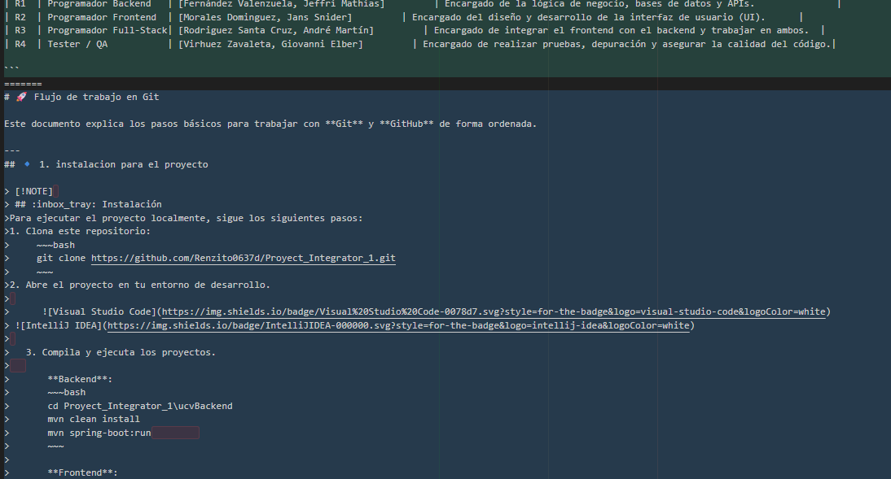
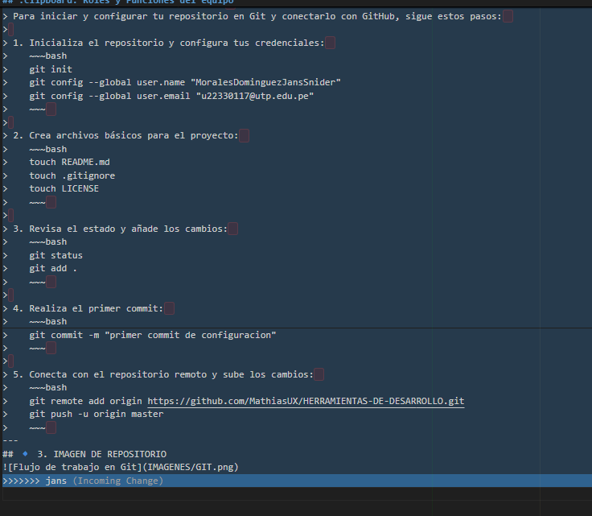
---
## 🔹 7. SOLUCIÓN DE CONFLICTO 
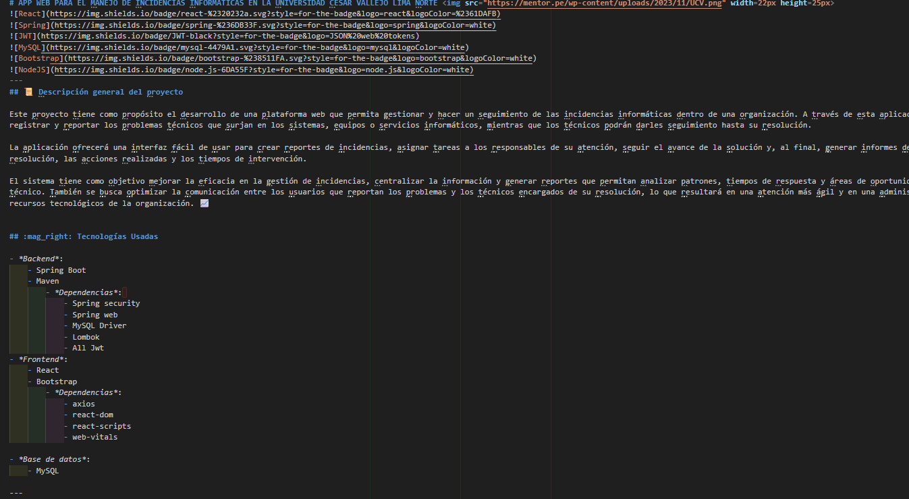
---
## 🔹 8. ISSUES Y LABELS
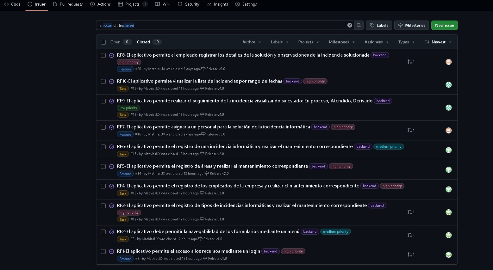
---
## 🔹 9. CERRANDO ISSUES 
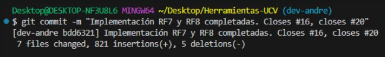
---
## 🔹 10. TABLERO PROJECT
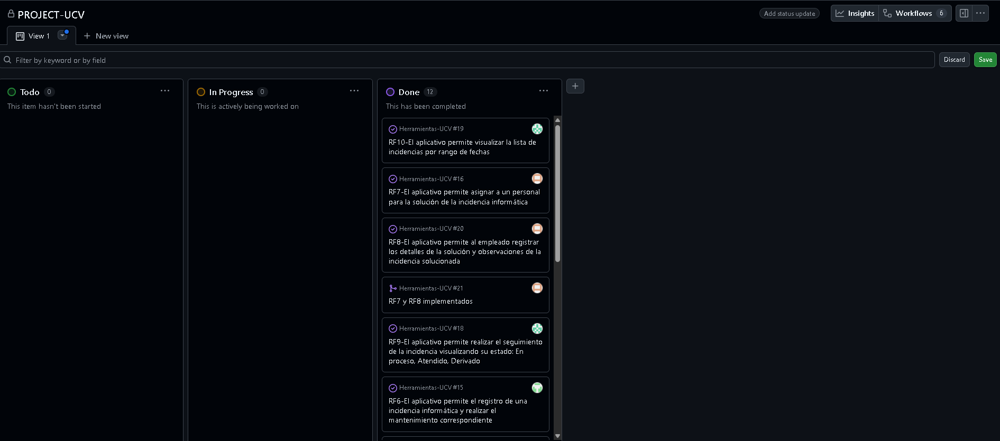
---
## 🔹 11. FORK CREADO
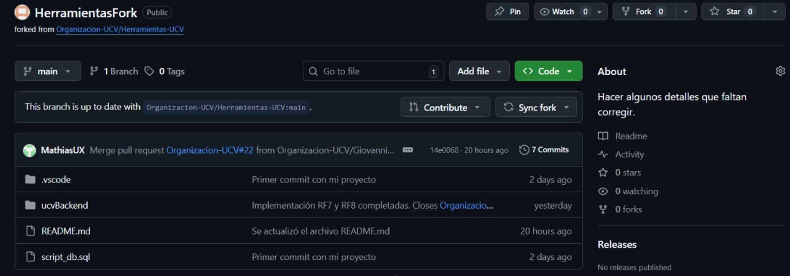
---
## 🔹 12. MILESTONES
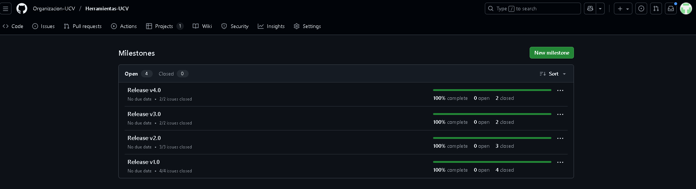
---
## 🔹 13. PULL REQUEST ACEPTADO
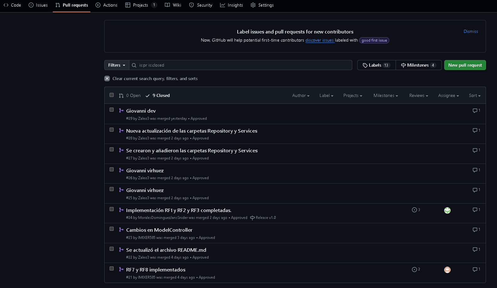